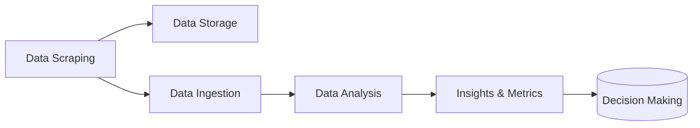

<a name="readme-top"></a>


<br />
<div align="center">
  <a href="https://github.com/Liftingthedata/xbox_de_project">
    
  </a>

  <h3 align="center">Xbox Data Scraping Pipeline</h3>

  <p align="center">
    A data-driven project that uses Python, Airflow, GCP and K8s to gather & provide insights into Xbox data.
</div>


<br>

<details>
  <summary>Table of Contents</summary>
  <ol>
    <li>
      <a href="#about-the-project">About The Project</a>
    </li>
    <li>
      <a href="#architecture">Architecture</a>
    </li>
    <li>
      <a href="#getting-started">Getting Started</a>
      <ul>
        <li><a href="#prerequisites">Prerequisites</a></li>
        <li><a href="#installation">Installation</a></li>
      </ul>
    </li>
  </ol>
</details>


## About The Project

[![Dashboard Screenshot][product-screenshot]](https://example.com)

The project aims to gather and analyze Xbox-specific data from multiple sources, including Metacritic, VGChartz, and Twitter. 
The collected data includes console and game sales, game ratings, user reviews, sentiment analysis for Xbox-related tweets, and more. 
The project utilizes scraping scripts written in Python. The pipline is orchestrated by Airflow, and the whole pipeline runs on Kubernetes (GKE) for efficient and scalable data processing.

## Architecture

<div align="center">
  <a>
    
  </a>

</div>


The architecture of the project is designed to collect, process, and analyze data related to Xbox in a periodic fashion.

A simplified overview of the project's architecture can be summarized in the flow chart below.



<!-- -   Data Sources:
    
    -   Metacritic: Provides game ratings and reviews.
    -   VGChartz: Offers Xbox console and game sales data.
    -   Twitter: Gathers Xbox-related tweets for sentiment analysis.
-   Scraping Scripts:
    
    -   Python scripts are developed to scrape data from Metacritic, VGChartz, and Twitter.
    -   Each script handles the specific scraping logic for its respective data source.
-   Data Extraction:
    
    -   The scraping scripts extract the relevant data from each source.
    -   Extracted data includes game ratings, reviews, sales figures, and tweets.
-   Data Storage:
    
    -   Extracted data is uploaded to Google Cloud Storage (GCS).
    -   GCS serves as a centralized storage location for the collected data.
-   Data Ingestion:
    
    -   The data from GCS is ingested into Google BigQuery.
    -   BigQuery is a scalable and fully-managed data warehouse that allows efficient querying and analysis of large datasets.
-   Data Analysis:
    
    -   The ingested data in BigQuery is analyzed using various techniques and algorithms.
    -   Sentiment analysis is performed on Twitter data to gauge user sentiment towards Xbox.
-   Dashboard and Insights:
    
    -   The analyzed data is used to generate metrics and statistics.
    -   A dashboard is created to present the insights obtained from the gathered data.
    -   The dashboard provides visualizations and key findings to aid decision-making. -->

## Getting Started


### Prerequisites


* [Google Cloud SDK](https://cloud.google.com/sdk/docs/install)


### Installation


1. Clone the repository:
```sh
git clone https://github.com/Elsayed91/xbox_de_project.git
```
2. Install Pipenv
```sh
pip install pipenv
```
3. rename template.env to .env and fill out the values
4. run project setup script:
```sh
make setup
```


