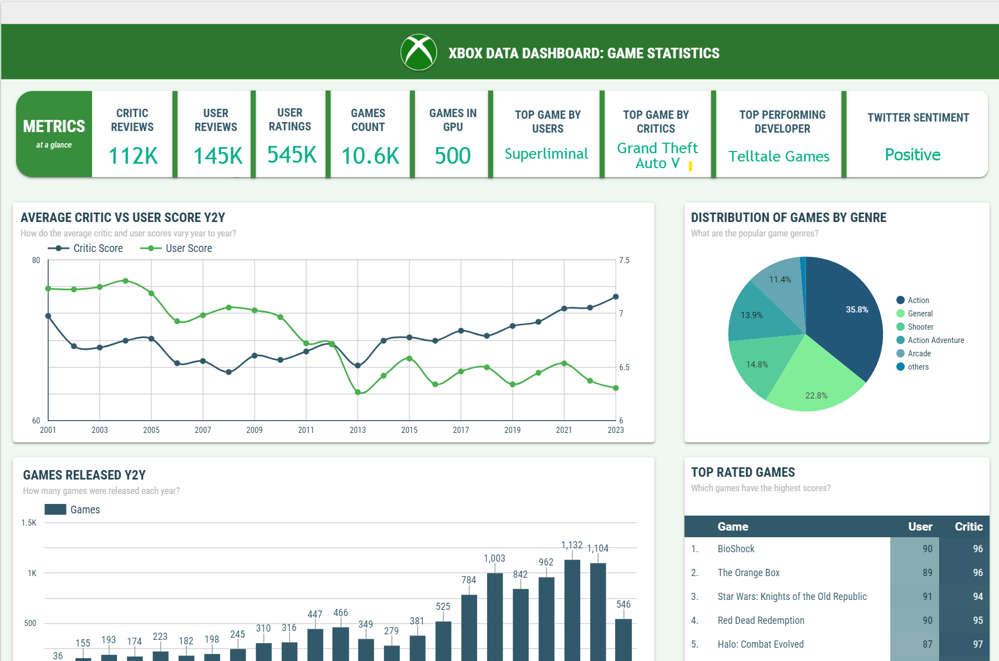
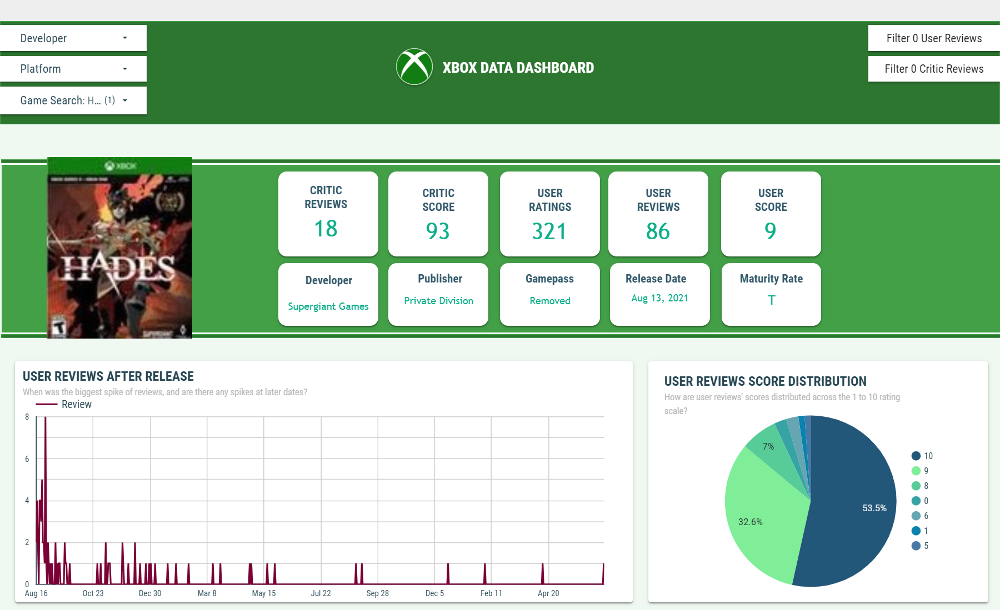
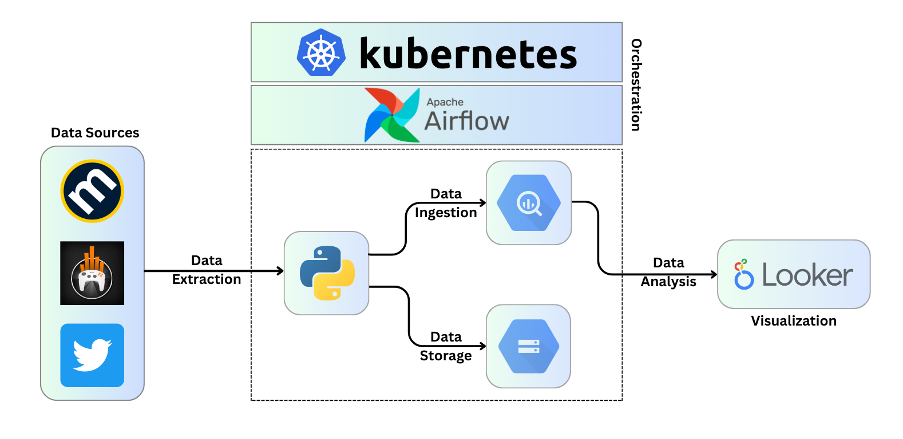
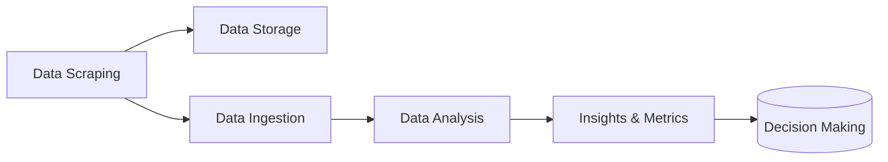

<a name="readme-top"></a>


<br />
<div align="center">
  <a href="https://github.com/Liftingthedata/xbox_de_project">
    
  </a>

  <h3 align="center">Xbox Data Scraping Pipeline</h3>

  <p align="center">
    A data-driven project that uses Python, Airflow, GCP and K8s to gather & provide insights into Xbox data.
</div>

<div align="center" style="display: flex;">
    <a href="images/dashboard-1.png" style="flex: 1; margin-right: 5px;">
        
    </a>
    <a href="images/dashboard-2.png" style="flex: 1; margin-left: 5px;">
        
    </a>
</div>
<br>
<div align="center">
  <a href="https://lookerstudio.google.com/u/3/reporting/3b68c870-507f-4618-8454-fbae208bbc14/page/1M">
    View Dashboard Here
  </a>


</div>

<br>

<details>
  <summary>Table of Contents</summary>
  <ol>
    <li><a href="#about-the-project">About The Project</a></li>
    <li><a href="#architecture">Architecture</a></li>
    <li>
      <a href="#getting-started">Getting Started</a>
      <ul>
        <li><a href="#prerequisites">Prerequisites</a></li>
        <li><a href="#installation">Installation</a></li>
      </ul>
    </li>
    <li><a href="#things-to-consider">Things to Consider</a></li>
    <li><a href="#how-to-improve">How to Improve</a></li>
  </ol>
</details>


## About The Project

This project aims to collect and analyze Xbox-specific data from various sources. This data include console and game sales, game ratings, user reviews, sentiment analysis for Xbox-related tweets, and more. The data collection process involves Python-based scraping scripts, while the pipeline is orchestrated by Airflow, running efficiently and at scale on Kubernetes (GKE) for data processing.

## Architecture

<div align="center">
  <a>
    
  </a>

</div>


The project's architecture is designed to periodically gather, process, and analyze data related to Xbox. The flowchart below provides a simplified overview:



    

## Getting Started


### Prerequisites


* [Google Cloud SDK](https://cloud.google.com/sdk/docs/install)


### Installation


1. Clone the repository:
```sh
git clone https://github.com/Elsayed91/xbox_de_project.git
```
2. Install Pipenv
```sh
pip install pipenv
```
3. Rename template.env to .env and fill out the values.
4. Run the project setup script:
```sh
make setup
```

### Things to consider:

-   **Weighted Performance Metric:** The dashboard employs a weighted performance metric to handle uncertainties in game ratings effectively. This approach ensures that games with only a few highly-rated reviews do not receive higher scores than games with many slightly lower ratings. The weighted metric is derived from Wilson's interval, a statistical method that takes into account the uncertainty tied to the true rating of a game.
    
-   **Game Pass Status Matching:** The function responsible for adding Game Pass Status to the data is functional; however, it may occasionally yield inaccurate results due to title mismatches between Metacritic.com and the Xbox Game Pass Master Sheet. While the dashboard addresses this issue, some individual gamepass status lookups might still be affected by these mismatches.


## How to improve

-   **Game Pass Status:** Monitor the project and create a list to fix troublesome titles, or consider using a different source, such as Xbox.com, to improve accuracy.
-   **Project Scope:** Expand the project to include Xbox PC.
-   **Data Modeling:** Data Modeling techniques could be implemented.
-   **Leverage Unitilized Metacritic Data:** Explore the number of players data from Metacritic to analyze trends.
-   **NLP and Sentiment Analysis:** Use NLP to extract key words associated with good and bad reviews and perform sentiment analysis on game reviews.
